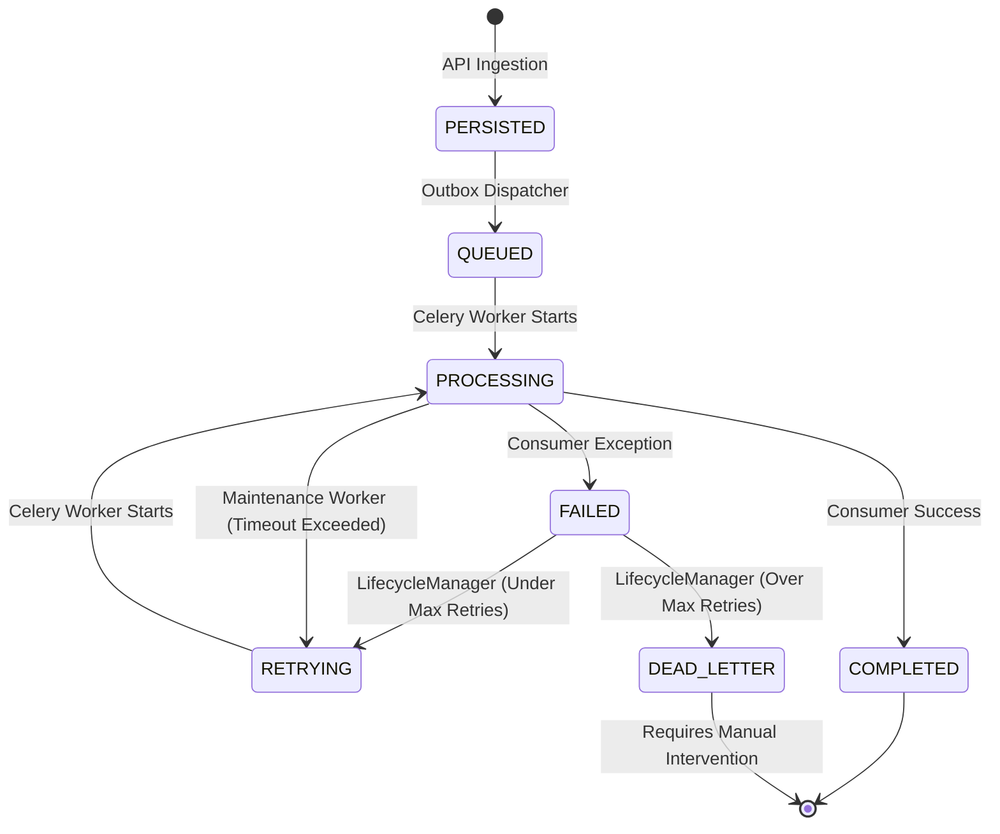

# HunterOS Event Lifecycle Architecture

This document describes the Asynchronous Processing Pipeline (Refinement Phase 1.3), detailing the event execution lifecycle, component responsibilities, and robust recovery strategies for HunterOS Core.

## Event Lifecycle State Diagram

The Event Store maintains an explicit lifecycle for every event to guarantee exactly-once processing semantics (idempotency) even in distributed environments.

### Enforced State Transitions
Transitions are strictly enforced by the **Event Lifecycle Manager** to prevent invalid state corruption (e.g., transitioning from `COMPLETED` to `PROCESSING`).
- **Valid to QUEUED**: `PERSISTED`, `RETRYING`
- **Valid to PROCESSING**: `QUEUED`, `RETRYING`
- **Valid to COMPLETED**: `PROCESSING`
- **Valid to FAILED**: `PROCESSING`
- **Valid to RETRYING**: `FAILED`, `PROCESSING` (Stale Recovery)
- **Valid to DEAD_LETTER**: `FAILED`, `PROCESSING` (Stale Recovery)

## Component Responsibilities

### 1. Outbox Dispatcher
The Dispatcher acts as the bridge between the transactional database and the asynchronous message broker (Redis/Celery).
- **Single Responsibility**: Poll the database for `PERSISTED` events and move them to `QUEUED` while enqueueing the ID in the broker.
- **Concurrency Control**: Utilizes `FOR UPDATE SKIP LOCKED` and batching to support multiple concurrent dispatcher processes without contention or duplicate dispatch.
- **Simplicity**: Operates on a pure polling interval. Contains no business logic.

### 2. Celery Worker (Engine)
The worker is a generic processing engine that knows nothing about specific business logic.
- **Execution Orchestration**: Receives an `event_id`, loads the `EventRecord`, and transitions the state to `PROCESSING`.
- **Deserialization**: Reconstructs the raw JSON payload back into strongly typed Domain Event models.
- **Routing**: Looks up applicable consumers from the Consumer Registry.
- **Resilience**: Captures exceptions, determines retry intervals (exponential backoff), and invokes the Lifecycle Manager for `FAILED` transitions.

### 3. Consumer Registry & Consumers
- **Declarative Registry**: Uses the `@consume(EventClass)` decorator to discover business logic modules at boot time, eliminating hardcoded switch statements.
- **Event Consumers**: Focused purely on business execution (e.g., sending a WhatsApp message, triggering AI analysis). They receive a fully hydrated Domain Event. They do not handle database lifecycle tracking, retries, or broker acknowledgment.

### 4. Event Lifecycle Manager
A dedicated internal service encapsulating all `EventRecord` state modifications.
- **Centralized Validation**: Raises explicit exceptions for invalid state transitions.
- **Observability**: Emits structured logs and throughput metrics (latency, errors) on every state change, feeding executive dashboards.

### 5. Maintenance Worker (Stale Recovery)
A background process (e.g., Celery Beat task) separated entirely from the Dispatcher.
- **Responsibility**: Detects "zombie" processes by querying for events stuck in the `PROCESSING` state past a configured timeout threshold.
- **Recovery**: Forces these events into `RETRYING` (if retries remain) or `DEAD_LETTER`.

## Flows

### Standard Retry Flow
1. Worker starts processing an event -> `PROCESSING`.
2. A downstream service (e.g., WhatsApp API) is down, raising a consumer exception.
3. Worker catches the exception.
4. Worker invokes Lifecycle Manager -> `FAILED`.
5. Lifecycle Manager evaluates `retry_count < max_retries`.
6. Calculates `next_retry_at` using exponential backoff.
7. Lifecycle Manager -> `RETRYING`.
8. The Dispatcher (or a dedicated delayed queue poller) picks up the `RETRYING` event when `next_retry_at` is reached, transitioning it back to `QUEUED`.

### Dead-Letter Flow
1. Worker encounters an exception -> `FAILED`.
2. Lifecycle Manager evaluates `retry_count >= max_retries`.
3. Event is marked as `DEAD_LETTER`.
4. Execution stops. Alerting triggers (metrics).
5. Operational tools (CLI/Dashboard) are used to review the `error_detail` and manually requeue the event once the root cause is resolved.
